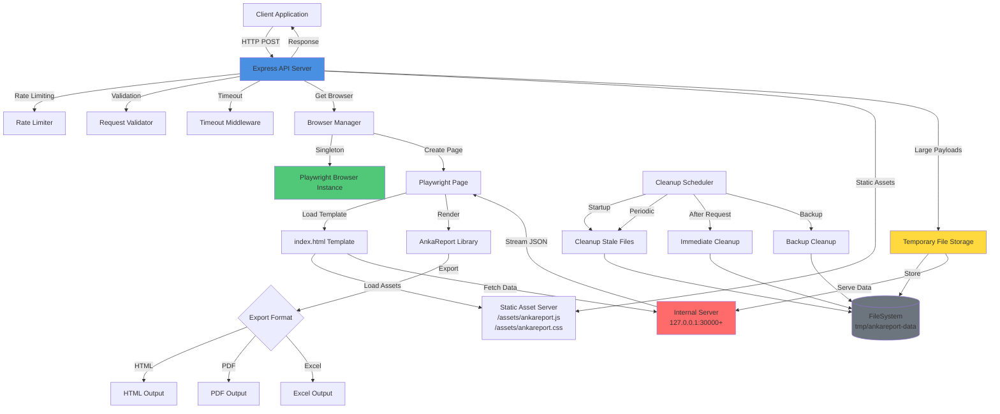
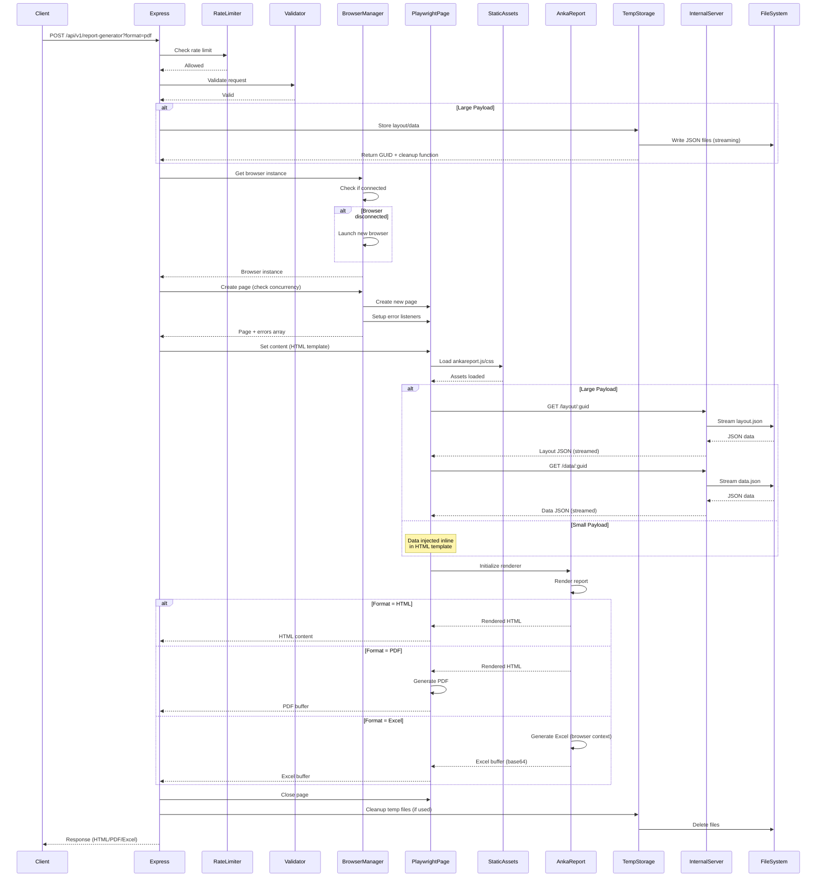
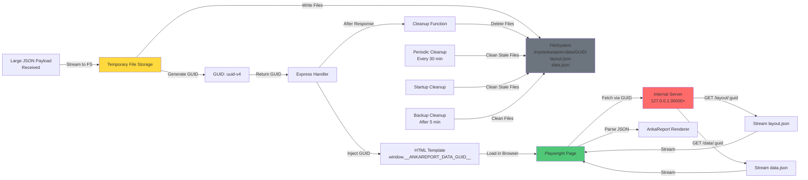
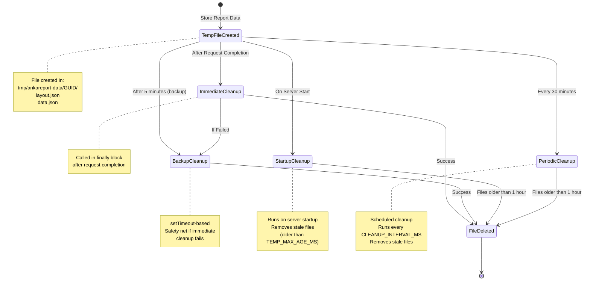
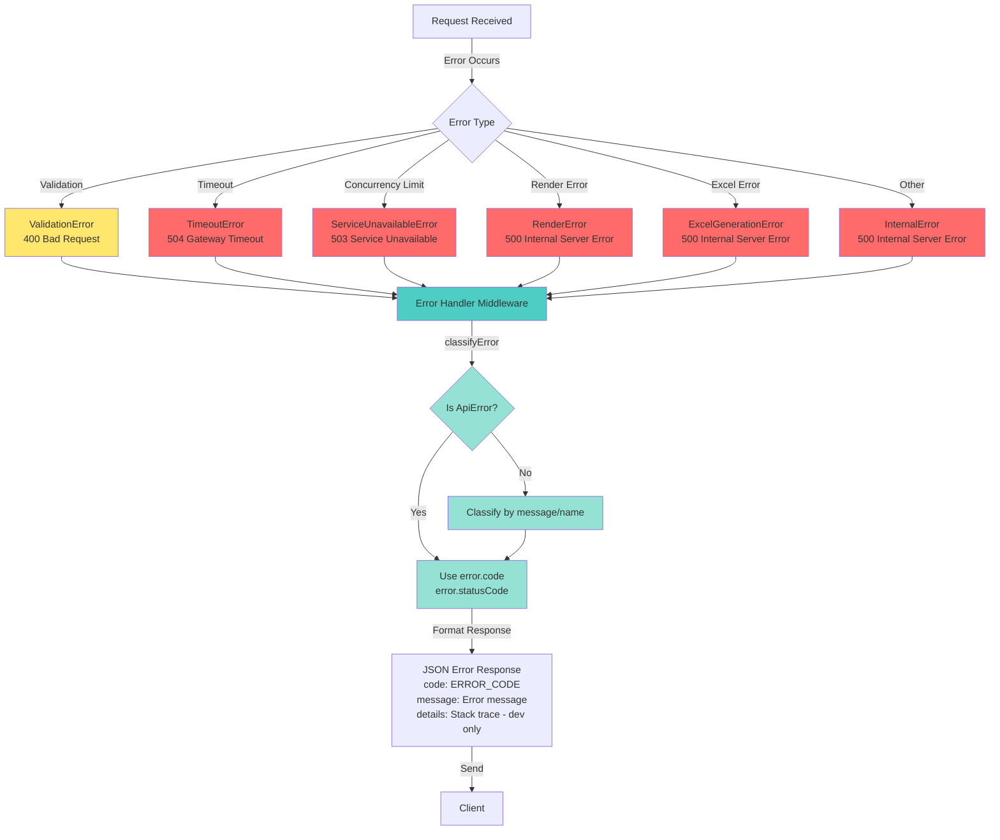

<h1 align="center">Anka Report</h1>

<p align="center">
  <a href="https://www.npmjs.com/package/ankareport" title="npm package">
    
  </a>
  <a href="https://opensource.org/licenses/MIT" title="License: MIT">
    
  </a>
</p>

<h3 align="center">
  <a href="https://ankareport.github.io/docs/getting-started" target="_blank" title="Documentation">Docs</a> |
  <a href="https://ankareport.github.io/examples/playground" target="_blank" title="Playground">Playground</a>
</h3>

<p align="center">
  
</p>

<p align="center">
  
</p>

## Purpose

Free & Open Source Web Reporting Tool with visual designer, data binding, and multi-format export capabilities.

## Features

### Report Items
- **Text** - Static and dynamic text with data binding, formatting, and conditional styles
- **Image** - Static images or data-bound image sources
- **Barcode** - CODE128 (A/B/C), EAN13, EAN8, UPC, CODE39, ITF14, ITF, MSI (10/11/1010/1110), Pharmacode formats with optional label display
- **QR Code** - QR codes with configurable error correction levels (L, M, Q, H)
- **Chart** - Line, Bar, Pie, Doughnut, Radar, PolarArea charts with data binding support

### Data Binding & Expressions
- Simple field binding: `binding: "fieldName"`
- Nested object access: `binding: "object.nested.field"`
- Array access: `binding: "items[0].name"`
- Expressions: `binding: "price * quantity"`
- Arrow Functions: `binding: "items.map(x => x.name).join(', ')"`
- String concatenation: `binding: "firstName + ' ' + lastName"`
- Built-in variables: `$index`, `$rowNum`, `$pageNum`, `$totalPages`
- Localization: `binding: "localize('key')"`

### Formatting
- Number formats: `format: "f2"` (2 decimal places), `format: "f0"` (integer)
- Date formats: Uses [Moment.js format](https://momentjs.com/docs/#/displaying/format/): `format: "MMMM DD, YYYY"`, `format: "YYYY-MM-DD"`
- Use filters for advanced formatting: `binding: "amount | currency:USD"`

### Conditional Styles
- Dynamic styling based on data conditions
- Supports: `color`, `backgroundColor`, `fontWeight`, `fontSize`, `borderColor`

### Sections
- **Header Section** - Report header (renders once at top)
- **Content Section** - Main data section (repeats for each data item)
- **Footer Section** - Report footer (renders once at bottom)
- **Page Header/Footer** - Appears on every page in PDF export
- **Subsections** - Nested data groups with their own bindings
- **Grouping** - Group data by field with group headers/footers

### Styling
- Colors, backgrounds, borders
- Font family, size, weight
- Text alignment (left, center, right)
- Inherited styles from parent sections

### Export
- **HTML** - Direct HTML rendering in browser
- **PDF** - Multi-page support, page headers/footers, font support (Helvetica, Times, Courier with bold variants)
- **Excel** - Cell-based export with styling, charts, and images
- **REST API** - Server-side report generation API with Docker support (see [API Documentation](#rest-api))

### Designer
- Visual drag-and-drop editor
- Property grid for all item properties
- Undo/Redo support
- Bulk selection and editing
- Tree view of elements

## Installation

```sh
npm install ankareport
# or
yarn add ankareport
```

## Setup (CDN)

```html
<html>
  <head>
    <link rel="stylesheet" href="https://unpkg.com/ankareport/dist/ankareport.css" />
  </head>
  <body>
    <script src="https://unpkg.com/ankareport/dist/ankareport.js"></script>
  </body>
</html>
```

## Quick Start

### Designer

```html
<div id="designer"></div>

<script>
  const designer = AnkaReport.designer({
    element: document.getElementById("designer"),
    dataSource: dataSource,
    layout: layout,
    onSaveButtonClick: (layout) => {
      console.log(JSON.stringify(layout, null, 2));
    },
  });
</script>
```

### Renderer

```html
<div id="report"></div>

<script>
  const report = AnkaReport.render({
    element: document.getElementById("report"),
    layout: layout,
    data: data,
  });
</script>
```

### Export to PDF

```js
// Export is a method on the renderer instance
const renderer = AnkaReport.render({
  element: document.getElementById("report"),
  layout: layout,
  data: data,
});

// Export to PDF (downloads file automatically)
await renderer.exportToPdf("report.pdf");
```

#### PDF Page Breaks

The PDF export automatically handles page breaks with the following features:

- **Automatic pagination** - Content is split across pages based on page size
- **Page headers/footers** - Rendered on every page with `$pageNum` and `$totalPages` variables
- **keepTogether** - Sections with `keepTogether: true` will not be split across pages
- **Pixel-perfect rendering** - All positions, sizes, and styles match the HTML preview

```js
// Example: Keep each department row together on the same page
contentSection: {
  height: 80,
  binding: "departments",
  keepTogether: true,  // Entire section moves to next page if it doesn't fit
  items: [ ... ]
}
```

### Export to Excel

```js
// Export is a method on the renderer instance
const renderer = AnkaReport.render({
  element: document.getElementById("report"),
  layout: layout,
  data: data,
});

// Export to Excel (downloads file automatically)
await renderer.exportToXlsx("report.xlsx");
```

## Layout Reference

### Layout Structure

```js
const layout = {
  pageSize: "A4",           // "A4", "Letter", "Legal", or custom
  width: 595,               // Optional: override page width (pixels)
  height: 842,              // Optional: override page height (pixels)
  
  // Styling (inherited by all sections)
  color: "#000000",
  backgroundColor: "#ffffff",
  fontFamily: "Arial",
  fontSize: "12px",
  fontWeight: "normal",
  
  // Page header/footer (appears on every PDF page)
  pageHeaderSection: { ... },
  pageFooterSection: { ... },
  initialPageNumber: 1,                   // Start page numbering from this value (default: 1)
  
  // Report sections
  headerSection: { ... },
  contentSection: { ... },
  footerSection: { ... },
};
```

### Section Structure

```js
{
  height: 100,              // Fixed height in pixels, or "auto"
  binding: "dataArray",     // Data source for repeating sections
  groupBy: "category",      // Optional: group data by field
  keepTogether: true,       // Keep section on same page if possible
  
  // Styling
  color: "#000000",
  backgroundColor: "#f5f5f5",
  
  // Items in this section
  items: [ ... ],
  
  // Nested subsections
  sections: [ ... ],
  
  // Group header/footer (when using groupBy)
  groupHeader: { ... },
  groupFooter: { ... },
}
```

### Page Header/Footer Section

Page headers and footers appear on every page in PDF export. They support special page numbering variables:

```js
pageHeaderSection: {
  height: "auto",
  binding: "",
  visibleOnFirstPage: true,   // Show on first page (default: false)
  visibleOnLastPage: true,    // Show on last page (default: false)
  items: [
    // Company name
    { type: "text", x: 40, y: 5, width: 200, height: 18, binding: "company.name" },
    
    // Page numbering: "Page 1 / 5"
    { type: "text", x: 470, y: 5, width: 30, height: 18, text: "Page" },
    { type: "text", x: 500, y: 5, width: 15, height: 18, binding: "$pageNum" },
    { type: "text", x: 515, y: 5, width: 10, height: 18, text: "/" },
    { type: "text", x: 525, y: 5, width: 20, height: 18, binding: "$totalPages" },
  ],
}
```

**Visibility Rules:**
- `visibleOnFirstPage: false` - Header/footer will NOT appear on page 1
- `visibleOnLastPage: false` - Header/footer will NOT appear on the last page
- Both default to `false`, so you must explicitly enable them

### Report Items

#### Text Item

```js
{
  type: "text",
  x: 10, y: 10,
  width: 200, height: 20,
  
  // Content
  text: "Static text",           // Static text
  binding: "fieldName",          // Or data binding
  format: "$#,##0",              // Optional formatting
  
  // Styling
  color: "#000000",
  backgroundColor: "transparent",
  textAlign: "left",             // "left", "center", "right"
  fontFamily: "Arial",
  fontSize: "12px",
  fontWeight: "normal",          // "normal", "bold", "700", etc.
  borderWidth: 1,
  borderStyle: "solid",
  borderColor: "#000000",
  
  // Visibility
  visible: "data.showField",     // Conditional visibility expression
  
  // Conditional styles
  conditionalStyles: [
    { condition: "value > 100", color: "#4CAF50", fontWeight: "bold" },
    { condition: "value < 0", color: "#F44336" }
  ]
}
```

#### Image Item

```js
{
  type: "image",
  x: 10, y: 10,
  width: 100, height: 100,
  source: "data:image/png;base64,...",  // Base64 or URL
  binding: "imageField",                 // Or data binding
}
```

#### Barcode Item

```js
{
  type: "barcode",
  x: 10, y: 10,
  width: 150, height: 50,
  value: "1234567890",           // Static value
  binding: "barcodeField",       // Or data binding
  format: "CODE128",             // CODE128, CODE128A/B/C, EAN13, EAN8, UPC, CODE39, ITF14, ITF, MSI, MSI10/11/1010/1110, pharmacode
  barWidth: 2,                   // Bar width (1, 2, 3, or 4)
  displayValue: false,           // Show text label under barcode
}
```

#### QR Code Item

```js
{
  type: "qrcode",
  x: 10, y: 10,
  width: 100, height: 100,
  value: "https://example.com",  // Static value
  binding: "urlField",           // Or data binding
  errorCorrectionLevel: "M",     // "L", "M", "Q", "H"
}
```

#### Chart Item

```js
{
  type: "chart",
  x: 10, y: 10,
  width: 300, height: 200,
  chartType: "line",             // "line", "bar", "pie", "doughnut", "radar", "polarArea"
  
  // Static data
  labels: ["Jan", "Feb", "Mar"],
  datasets: [
    { label: "Sales", data: [100, 200, 150], borderColor: "#4CAF50" }
  ],
  
  // Or data binding
  labelsBinding: "chart.labels",
  datasetsBinding: "[{label: 'Sales', data: chart.salesData, borderColor: '#4CAF50'}]",
  
  // Title
  title: "Monthly Sales",
  titleBinding: "localize('chart_title')",
  
  // Legend
  showLegend: true,
  legendPosition: "bottom",      // "top", "bottom", "left", "right"
  
  // Axis configuration
  scales: {
    x: {
      title: { display: true, text: "Month" },
      stacked: false,
    },
    y: {
      title: { display: true, text: "Amount" },
      beginAtZero: true,
      min: 0,                    // Optional min value
      max: 1000,                 // Optional max value
      minBinding: "chart.minY", // Or data binding
      maxBinding: "chart.maxY",
    }
  }
}
```

## Expression Reference

### Built-in Variables

| Variable | Description |
|----------|-------------|
| `$index` | Zero-based index of current item in array |
| `$rowNum` | One-based row number (index + 1) |
| `$pageNum` | Current page number (PDF only) |
| `$totalPages` | Total page count (PDF only) |
| `$groupKey` | Current group key value (when using groupBy) |
| `$groupCount` | Number of items in current group |
| `$first` | First item in current group |
| `$last` | Last item in current group |
| `$sum_field` | Sum of field values in group (e.g., `$sum_amount`) |
| `$avg_field` | Average of field values in group |
| `$min_field` | Minimum field value in group |
| `$max_field` | Maximum field value in group |

### Temporal Variables

Available when `context.temporal` is provided in data:

| Variable | Description |
|----------|-------------|
| `$nowUtc` | Current UTC datetime |
| `$nowLocal` | Current local datetime |
| `$timeZoneId` | Current timezone ID |
| `$utcOffsetMinutes` | UTC offset in minutes |

### Functions

| Function | Description | Example |
|----------|-------------|---------|
| `localize(key, [default], [locale], [res])` | Get localized string. Optional: default text, locale code, resources object. | `localize('title', 'Report', 'en-US')` |
| `convertTz(date, toTz, [fromTz])` | Convert timezone. `toTz` is target IANA zone. `fromTz` is optional source zone. | `convertTz(date, 'America/New_York')` |
| `sum(array)` | Sum array values | `sum(items.map(i => i.amount))` |
| `avg(array)` | Average array values | `avg(scores)` |
| `count(array)` | Count array items | `count(items)` |
| `min(array)` | Minimum value | `min(prices)` |
| `max(array)` | Maximum value | `max(prices)` |

### Filters (Pipe Syntax)

```js
// Usage: binding: "expression | filter:arg1:arg2"

// String filters
"text | uppercase"               // Convert to uppercase
"text | lowercase"               // Convert to lowercase
"text | capitalize"              // Capitalize first letters
"text | trim"                    // Remove whitespace
"text | truncate:50:..."         // Truncate with suffix
"text | padstart:5:0"            // Pad start: "42" -> "00042"
"text | padend:5:0"              // Pad end: "42" -> "42000"
"text | replace:old:new"         // Replace text
"text | slice:0:10"              // Substring

// Number filters
"amount | currency:USD:en-US"    // Format as currency: $1,234.56
"amount | number:2"              // Fixed decimals: 1234.56
"amount | percent:1"             // Percentage: 12.3%
"amount | abs"                   // Absolute value
"amount | round"                 // Round to integer
"amount | floor"                 // Round down
"amount | ceil"                  // Round up

// Date filters
"date | date:YYYY-MM-DD"         // Format date
"date | time"                    // Time only
"date | datetime"                // Date and time

// Other
"value | default:N/A"            // Default if null/empty
"object | json"                  // JSON stringify
```

## Conditional Styles

Apply dynamic styles based on data conditions:

```js
{
  type: "text",
  binding: "status",
  conditionalStyles: [
    // Green background for "active" status
    { 
      condition: "status == 'active'", 
      backgroundColor: "#4CAF50", 
      color: "#FFFFFF" 
    },
    // Red for "inactive"
    { 
      condition: "status == 'inactive'", 
      backgroundColor: "#F44336", 
      color: "#FFFFFF" 
    },
    // Bold for high values
    { 
      condition: "value > 1000", 
      fontWeight: "bold",
      color: "#2196F3"
    }
  ]
}
```

### Supported Conditional Style Properties

- `color` - Text color
- `backgroundColor` - Background color
- `fontWeight` - Font weight ("normal", "bold", "700", etc.)
- `fontSize` - Font size ("12px", "14px", etc.)
- `borderColor` - Border color

## Data Source (Designer)

Define available fields for the designer's field picker:

```js
const dataSource = [
  { label: "Company Name", field: "company.name" },
  { label: "Report Year", field: "reportYear" },
  {
    label: "Summary",
    children: [
      { label: "Total Revenue", field: "summary.totalRevenue" },
      { label: "Total Expenses", field: "summary.totalExpenses" },
      { label: "Net Profit", field: "summary.netProfit" },
    ],
  },
  {
    label: "Departments",
    field: "departments",
    children: [
      { label: "Name", field: "name" },
      { label: "Manager", field: "manager" },
      { label: "Revenue", field: "revenue" },
      {
        label: "Projects",
        field: "projects",
        children: [
          { label: "Project Name", field: "name" },
          { label: "Budget", field: "budget" },
        ],
      },
    ],
  },
];
```

## Localization

Provide translations via the `context.localization` object in your data:

```js
const data = {
  // ... your data
  
  context: {
    localization: {
      localeCode: "en-US",  // Current locale
      resources: {
        "en-US": {
          report_title: "Annual Report",
          executive_summary: "Executive Summary",
          departments: "Departments",
        },
        "es-ES": {
          report_title: "Informe Anual",
          executive_summary: "Resumen Ejecutivo",
          departments: "Departamentos",
        },
        "ro-RO": {
          report_title: "Raport Anual",
          executive_summary: "Rezumat Executiv",
          departments: "Departamente",
        },
      },
    },
  },
};
```

Use in layout:

```js
// Basic usage - returns key if not found
{ type: "text", binding: "localize('report_title')" }

// With default text fallback
{ type: "text", binding: "localize('report_title', 'Annual Report')" }

// With explicit locale override
{ type: "text", binding: "localize('report_title', 'Annual Report', 'es-ES')" }

// With dynamic key from data
{ type: "text", binding: "localize(labelKey, 'Default')" }
```

## Page Sizes

Supported page sizes (defined in `PageSize` type):

| Size | Width (pt) | Height (pt) |
|------|------------|-------------|
| A2 | 1191 | 1684 |
| A3 | 842 | 1191 |
| A4 | 595 | 842 |
| A5 | 420 | 595 |
| Letter | 612 | 792 |
| Legal | 612 | 1008 |
| Tabloid | 792 | 1224 |

Or use custom dimensions:

```js
{
  pageSize: undefined,  // or omit
  width: 800,
  height: 600,
}
```

## REST API

AnkaReport includes a production-ready Express API server for server-side report generation. The API supports HTML, PDF, and Excel export formats using Playwright for headless browser rendering.

### Features

- ✅ **HTML Export** - Generate rendered HTML reports
- ✅ **PDF Export** - Generate PDF reports from layouts
- ✅ **Excel Export** - Generate Excel files with charts, barcodes, and QR codes
- ✅ **Swagger Documentation** - Interactive API documentation at `/swagger`
- ✅ **Health Check** - Monitor API health at `/health`
- ✅ **Docker Support** - Multi-stage Dockerfile for optimized production images
- ✅ **Error Handling** - Comprehensive error classification and handling
- ✅ **Rate Limiting** - Configurable request rate limits
- ✅ **Security** - Helmet.js security headers, CORS, input validation

### Quick Start

#### Using Docker (Recommended)

```bash
# Start the API server
docker-compose up

# The API will be available at http://localhost:3000
# Swagger documentation: http://localhost:3000/swagger
```

#### Local Development

```bash
# Install dependencies
npm run api:install

# Build AnkaReport and start API in development mode
npm run api:dev

# Or build and start separately
npm run api:build
npm run api:start
```

### API Endpoints

#### POST /api/v1/report-generator

Generate report in HTML, PDF, or Excel format. Supports both `application/json` and `multipart/form-data`.

**Query Parameters:**
- `format` (required): `html`, `pdf`, or `excel`
- `filename` (optional): Output filename (sanitized automatically)

**Request Body:**
```json
{
  "data": {
    "company": { "name": "Example Corp" },
    "departments": [
      { "name": "Sales", "revenue": 100000 }
    ]
  },
  "layout": {
    "pageSize": "A4",
    "headerSection": {
      "items": [
        { "type": "text", "x": 40, "y": 20, "width": 200, "height": 30, "binding": "company.name" }
      ]
    },
    "contentSection": {
      "binding": "departments",
      "items": [
        { "type": "text", "x": 40, "y": 60, "width": 150, "height": 20, "binding": "name" },
        { "type": "text", "x": 200, "y": 60, "width": 100, "height": 20, "binding": "revenue", "format": "f2" }
      ]
    }
  }
}
```

**Multipart Form Data (Recommended for large files):**
- `data`: Report data (JSON file)
- `layout`: AnkaReport layout (JSON file)

**Response:**
- HTML: `Content-Type: text/html`
- PDF: `Content-Type: application/pdf`
- Excel: `Content-Type: application/vnd.openxmlformats-officedocument.spreadsheetml.sheet`

**Example using cURL:**
```bash
# Generate PDF (JSON request)
curl -X POST "http://localhost:3000/api/v1/report-generator?format=pdf&filename=report" \
  -H "Content-Type: application/json" \
  -d '{"data": {...}, "layout": {...}}' \
  --output report.pdf

# Generate PDF (Multipart request - Recommended)
curl -X POST "http://localhost:3000/api/v1/report-generator?format=pdf&filename=report" \
  -F "data=@data.json" \
  -F "layout=@layout.json" \
  --output report.pdf

# Generate Excel (Multipart request)
curl -X POST "http://localhost:3000/api/v1/report-generator?format=excel&filename=report" \
  -F "data=@data.json" \
  -F "layout=@layout.json" \
  --output report.xlsx
```

#### GET /health

Health check endpoint.

**Response:**
```json
{
  "status": "healthy",
  "browser": "connected",
  "uptime": 12345
}
```

#### GET /swagger

Interactive API documentation with Swagger UI.

### Environment Variables

Create `api/.env` file for configuration:

```env
PORT=3000
NODE_ENV=production
MAX_REQUEST_SIZE=50mb
REQUEST_TIMEOUT_MS=120000
RATE_LIMIT_MAX=100
RATE_LIMIT_WINDOW_MS=900000
MAX_CONCURRENT_PAGES=10
BASE_URL=http://localhost:3000
ALLOWED_ORIGINS=*
NODE_OPTIONS=--max-old-space-size=4096

# Temporary file storage configuration
TEMP_DIR=tmp/ankareport-data
TEMP_CLEANUP_DELAY_MS=300000
TEMP_MAX_AGE_MS=3600000
CLEANUP_INTERVAL_MS=1800000
```

**Configuration Options:**

**Server Configuration:**
- `PORT` - Server port (default: 3000)
- `MAX_REQUEST_SIZE` - Maximum request body size (default: 50mb)
- `REQUEST_TIMEOUT_MS` - Request timeout in milliseconds (default: 120000 = 2 minutes)
- `RATE_LIMIT_MAX` - Maximum requests per window (default: 100)
- `RATE_LIMIT_WINDOW_MS` - Rate limit window in milliseconds (default: 900000 = 15 minutes)
- `MAX_CONCURRENT_PAGES` - Maximum concurrent Playwright pages (default: 10)
- `BASE_URL` - Base URL for asset serving (default: http://localhost:PORT)
- `ALLOWED_ORIGINS` - CORS allowed origins (default: *)

**Temporary File Storage Configuration:**
- `TEMP_DIR` - Directory for temporary files (default: `tmp/ankareport-data`)
- `TEMP_CLEANUP_DELAY_MS` - Backup cleanup delay in milliseconds (default: 300000 = 5 minutes)
- `TEMP_MAX_AGE_MS` - Stale file age threshold in milliseconds (default: 3600000 = 1 hour)
- `CLEANUP_INTERVAL_MS` - Periodic cleanup interval in milliseconds (default: 1800000 = 30 minutes)

### Docker Deployment

The API includes a multi-stage Dockerfile and docker-compose.yml for production deployments.

#### Build Docker Image

```bash
# Build the image
docker build -t ankareport-api .

# Build with a specific tag
docker build -t ankareport-api:1.0.0 .

# Build with no cache (for fresh builds)
docker build --no-cache -t ankareport-api .
```

The Dockerfile uses a multi-stage build:
1. **Stage 1 (builder)** - Builds the AnkaReport library
2. **Stage 2 (api-builder)** - Builds the API server
3. **Stage 3 (runtime)** - Uses Playwright's Docker image for PDF/Excel rendering

#### Run Container

```bash
# Basic run
docker run -p 3000:3000 ankareport-api

# Run in background
docker run -d -p 3000:3000 --name ankareport ankareport-api

# Run with custom environment variables
docker run -d -p 3000:3000 \
  -e MAX_REQUEST_SIZE=100mb \
  -e REQUEST_TIMEOUT_MS=180000 \
  -e MAX_CONCURRENT_PAGES=20 \
  --name ankareport ankareport-api

# Run with memory limits
docker run -d -p 3000:3000 \
  --memory=4g --memory-reservation=2g \
  --name ankareport ankareport-api
```

#### Docker Compose (Recommended)

The included `docker-compose.yml` provides production-ready defaults:

```bash
# Build and start the service
docker-compose up --build

# Start in background (detached mode)
docker-compose up -d

# Start with rebuild (after code changes)
docker-compose up -d --build

# View logs
docker-compose logs -f

# View logs for last 100 lines
docker-compose logs -f --tail=100

# Stop service
docker-compose down

# Stop and remove volumes
docker-compose down -v

# Restart service
docker-compose restart
```

##### Customizing docker-compose.yml

The default `docker-compose.yml` includes:

```yaml
services:
  api:
    build:
      context: .
      dockerfile: Dockerfile
    ports:
      - "3000:3000"
    environment:
      - PORT=3000
      - NODE_ENV=production
      - MAX_REQUEST_SIZE=50mb
      - REQUEST_TIMEOUT_MS=120000
      - RATE_LIMIT_MAX=100
      - RATE_LIMIT_WINDOW_MS=900000
      - MAX_CONCURRENT_PAGES=10
      - NODE_OPTIONS=--max-old-space-size=4096
    deploy:
      resources:
        limits:
          memory: 4G
        reservations:
          memory: 2G
    healthcheck:
      test: ["CMD", "wget", "--quiet", "--tries=1", "--spider", "http://localhost:3000/health"]
      interval: 30s
      timeout: 10s
      retries: 3
      start_period: 40s
    restart: unless-stopped
```

To customize, create a `docker-compose.override.yml`:

```yaml
# docker-compose.override.yml
services:
  api:
    ports:
      - "8080:3000"  # Use port 8080 externally
    environment:
      - MAX_REQUEST_SIZE=100mb
      - MAX_CONCURRENT_PAGES=20
```

##### Health Monitoring

The container includes a health check that monitors the `/health` endpoint:

```bash
# Check container health status
docker-compose ps

# View health check logs
docker inspect --format='{{json .State.Health}}' ankareport-api-1
```

##### Production Deployment Tips

1. **Resource Allocation**: Ensure adequate memory (4GB+ recommended) for Playwright browser rendering
2. **Restart Policy**: The `restart: unless-stopped` policy ensures automatic recovery after crashes
3. **Health Checks**: Monitor the `/health` endpoint for service availability
4. **Logging**: Configure log rotation for production:
   ```yaml
   logging:
     driver: "json-file"
     options:
       max-size: "10m"
       max-file: "3"
   ```
5. **Scaling**: For high-load scenarios, use a load balancer with multiple containers

### Architecture

The API server is built with a modern, production-ready architecture designed for reliability, performance, and scalability.

#### System Overview

The API consists of several key components working together:

1. **Express HTTP Server** - Main API server handling HTTP requests
2. **Playwright Browser Instance** - Singleton Chromium browser for rendering
3. **Internal Server** - Localhost-only server for secure data access
4. **Temporary File Storage** - Filesystem-based storage for large payloads
5. **Static Asset Serving** - Serves AnkaReport JS/CSS bundles

#### System Architecture Diagram



#### Request Flow Diagram



#### Large Payload Handling Flow



#### Cleanup Mechanisms Flow



#### Component Details

**1. Express API Server (`api/server.ts`)**
- Main HTTP server handling all API requests
- Middleware stack: Helmet (security), CORS, rate limiting, request timeout
- Route handlers for report generation, health checks, and Swagger
- Error handling middleware with custom error classes
- Graceful shutdown with resource cleanup

**2. Playwright Browser Manager**
- **Singleton Pattern**: Single browser instance shared across all requests
- **Page Isolation**: Each request gets its own Playwright page
- **Concurrency Control**: Atomic page creation with configurable limit
- **Error Handling**: Comprehensive error listeners (pageerror, console, crash)
- **Crash Recovery**: Automatic browser restart on disconnect

**3. Internal Server (`api/utils/internal-server.ts`)**
- Separate Express server bound to `127.0.0.1` only (localhost)
- Not accessible externally (security)
- Automatically finds available port (starting from 30000)
- Endpoints:
  - `GET /layout/:guid` - Streams layout JSON file
  - `GET /data/:guid` - Streams data JSON file
- Integrated with main server lifecycle (starts/stops together)

**4. Temporary File Storage (`api/utils/temp-storage.ts`)**
- Stores large JSON payloads in filesystem
- Uses GUID (UUID v4) for file identification
- Streaming support for efficient I/O
- Multiple cleanup mechanisms:
  - **Immediate**: After request completion (when integrated)
  - **Backup**: Timeout-based (5 minutes default)
  - **Startup**: Removes stale files on server start
  - **Periodic**: Scheduled cleanup every 30 minutes (default)

**5. Static Asset Serving**
- Serves AnkaReport JS/CSS from `api/public/libs/`
- HTTP caching headers (1 year cache)
- Template (`index.html`) cached in memory
- Works in both local and Docker environments

#### Export Format Details

**HTML Export:**
1. Load `index.html` template
2. Inject layout/data (inline for small payloads, GUID for large)
3. Load AnkaReport library from static assets
4. Initialize renderer in browser context
5. Extract rendered HTML from DOM
6. Return HTML string

**PDF Export:**
1. Same as HTML export (steps 1-4)
2. Use Playwright's native `page.pdf()` method
3. Configure PDF options (page size, margins, etc.)
4. Return PDF buffer

**Excel Export:**
1. Load `index.html` template
2. Inject layout/data
3. Load AnkaReport library
4. Execute `AnkaReport.exportToXlsx()` in browser context
5. Convert Excel buffer to base64 (chunked to avoid stack overflow)
6. Return Excel buffer

#### Error Handling Architecture



#### Performance Optimizations

1. **Browser Instance Reuse**
   - Single browser instance shared across requests
   - Reduces memory usage and startup time
   - Pages are isolated per request

2. **Asset Caching**
   - HTML template cached in memory
   - Static assets served with HTTP cache headers
   - Reduces disk I/O

3. **Streaming I/O**
   - Large JSON files streamed to/from filesystem
   - Reduces memory usage for large payloads
   - Non-blocking operations

4. **Concurrency Control**
   - Atomic page creation prevents race conditions
   - Configurable limit prevents resource exhaustion
   - Proper cleanup ensures resources are released

5. **Efficient Export Methods**
   - PDF: Native Playwright (no external libraries)
   - Excel: Browser context (leverages bundled libraries)
   - HTML: Direct DOM extraction

### Performance

- **Browser Instance Reuse** - Single browser instance shared across requests
- **Isolated Pages** - Each request gets its own Playwright page
- **Concurrency Control** - Configurable limit on concurrent pages
- **Asset Caching** - Template and static assets cached in memory
- **Efficient Export** - Native Playwright PDF generation, browser-based Excel generation

### Security

- **Helmet.js** - Security headers (CSP, XSS protection, etc.)
- **CORS** - Configurable cross-origin resource sharing
- **Rate Limiting** - Prevents abuse
- **Input Validation** - Request body and parameter validation
- **Filename Sanitization** - Prevents path traversal attacks
- **Resource Limits** - Request size and concurrency limits

### Error Handling

The API uses custom error classes for better error classification:

- `ValidationError` (400) - Invalid input
- `TimeoutError` (504) - Request timeout
- `ServiceUnavailableError` (503) - Service unavailable
- `RenderError` (500) - Rendering errors
- `ExcelGenerationError` (500) - Excel generation errors
- `InternalError` (500) - Internal server errors

Error responses follow this format:
```json
{
  "error": {
    "code": "VALIDATION_ERROR",
    "message": "Missing required fields: data and layout are required",
    "details": "..." // Only in development mode
  }
}
```

### Limitations & Considerations

- **Large Payloads** - The API supports large JSON payloads (configurable via `MAX_REQUEST_SIZE`), but very large payloads may impact performance
- **Concurrency** - Limited by `MAX_CONCURRENT_PAGES` (default: 10)
- **Memory Usage** - Playwright browser instances consume memory; adjust Docker memory limits as needed
- **Timeout** - Requests exceeding `REQUEST_TIMEOUT_MS` will be aborted

For more details, see [api/README.md](api/README.md).

## Contributing

```sh
yarn install
yarn dev
# open localhost:8080
```

## Testing

The project uses [Jest](https://jestjs.io/) for unit and integration testing.

```sh
# Run all tests
npm test

# Run specific test file
npm test src/renderer/renderer.test.ts

# Run tests in watch mode
npm test -- --watch
```

Tests cover:
- **Core Logic**: Expressions, formatting, layout generation.
- **Renderer**: DOM generation and section rendering (via JSDOM).
- **Exporters**: Excel export logic (verified with Node environment).
- **Components**: Property grid editors and event handling.


## License

MIT
